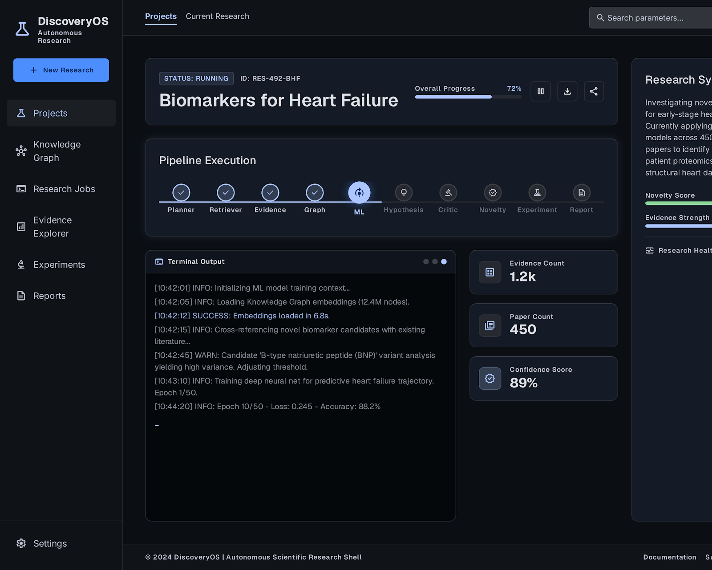
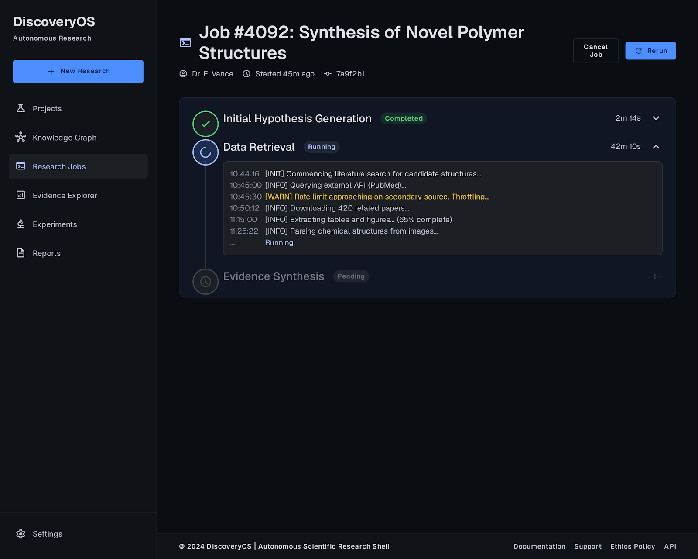
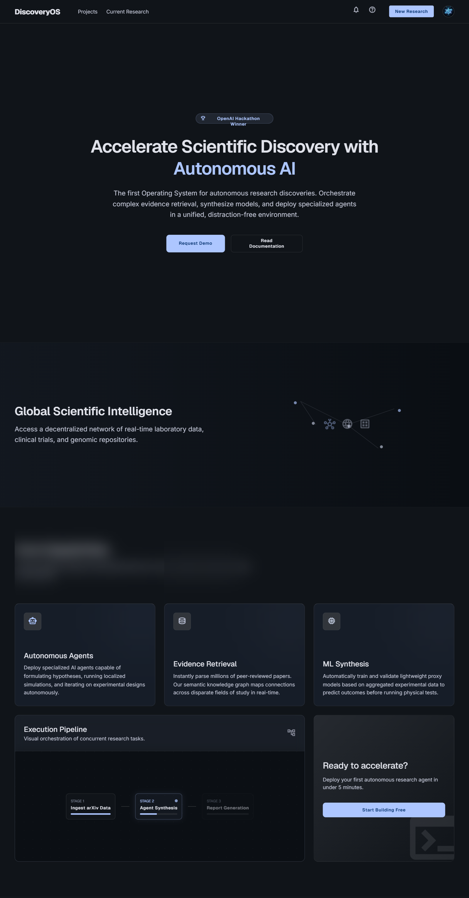
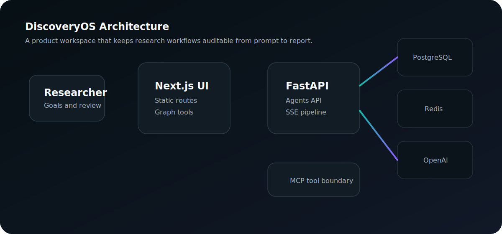
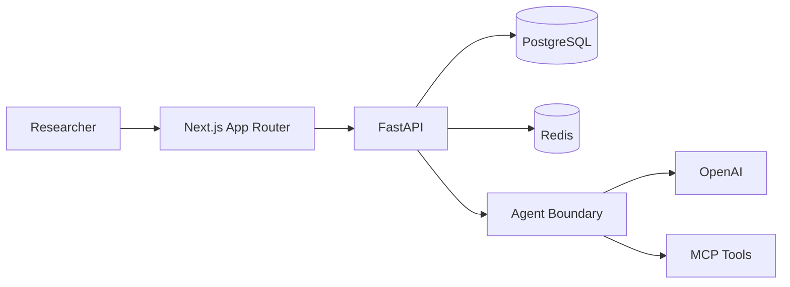
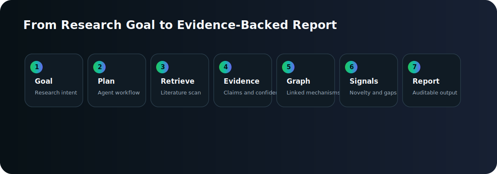

# DiscoveryOS


## Autonomous Scientific Discovery, Built as a Product

DiscoveryOS is a premium research operating system for teams that need more than a chat window. It turns scientific goals into auditable workflows: evidence maps, knowledge graphs, hypotheses, experiment plans, ML insight surfaces, and transparent reports.

**Tagline:** From research question to evidence-backed discovery workflow.

DiscoveryOS is designed for serious scientific work: persistent project memory, visible agent execution, deterministic demo data, OpenAI-ready orchestration, MCP tool boundaries, and a polished Next.js workspace that feels fast enough to use all day.

## Screenshots

| Command Dashboard | Evidence Explorer | Knowledge Graph |
| --- | --- | --- |
|  |  |  |

| Project Workspace | Execution Timeline | Landing Experience |
| --- | --- | --- |
|  |  |  |

## Architecture



DiscoveryOS separates the product workspace from the agent execution boundary. The frontend stays fast through static routes, client-side prefetching, and deferred graph rendering. The backend exposes a FastAPI surface for health checks, readiness, deterministic pipeline streams, seeded research data, and future live model/tool execution.



## Pipeline



1. Define a research goal.
2. Plan the agent workflow.
3. Retrieve and structure evidence.
4. Extract claims, confidence, and contradictions.
5. Build a navigable knowledge graph.
6. Surface novelty, feasibility, and ML-style signals.
7. Produce an auditable report and experiment plan.

## Features

- Persistent research workspaces for multi-step scientific programs.
- Agent command center with deterministic streaming execution.
- Evidence explorer with sources, claims, confidence, and contradiction states.
- Knowledge graph explorer for entities, mechanisms, findings, and edges.
- Hypothesis, experiment, ML insight, report, and settings surfaces.
- OpenAI-ready service boundary for structured reasoning and synthesis.
- MCP-ready architecture for external tools, files, memory, and research systems.
- Docker Compose stack with frontend, backend, Postgres, Redis, health checks, and seeded demo data.

## DiscoveryOS vs ChatGPT

| Capability | DiscoveryOS | ChatGPT |
| --- | --- | --- |
| Research state | Persistent project workspace | Conversation-centered |
| Evidence model | Structured claims, sources, confidence, contradictions | Usually text-first unless custom-built |
| Workflow visibility | Pipeline, agent stages, logs, reports | Mostly conversational |
| Knowledge graph | First-class graph interface | Requires external tooling |
| Team/product shape | SaaS-style research operating system | General assistant |
| MCP posture | Built around tool boundaries | Depends on environment and configuration |
| OpenAI role | Agent reasoning and synthesis layer | Primary user interface |

## OpenAI

DiscoveryOS is designed to use OpenAI as a reasoning and synthesis layer behind product workflows. The demo remains stable without a live key, while production deployments can enable live model calls through environment variables:

```bash
DISCOVERYOS_OPENAI_API_KEY=
DISCOVERYOS_OPENAI_BASE_URL=https://api.openai.com/v1
DISCOVERYOS_OPENAI_MODEL=gpt-5.6
```

## MCP

The architecture keeps MCP as a clear tool boundary for external research capabilities: memory, filesystem context, repository operations, literature tools, and future lab or data connectors. See [docs/05-MCP.md](docs/05-MCP.md) for the integration model.

## Installation

```bash
npm install
python -m pip install -e apps/api[dev]
```

Run locally without Docker:

```bash
npm run dev:web
npm run dev:api
```

Open [http://localhost:3000](http://localhost:3000).

## Docker

Start the complete stack:

```bash
cp .env.example .env
docker compose up --build
```

Services:

- Web app: [http://localhost:3000](http://localhost:3000)
- API health: [http://localhost:8000/api/v1/health](http://localhost:8000/api/v1/health)
- API readiness: [http://localhost:8000/api/v1/ready](http://localhost:8000/api/v1/ready)

Development mode:

```bash
docker compose -f docker-compose.yml -f docker-compose.dev.yml up --build
```

Production mode:

```bash
docker compose -f docker-compose.yml -f docker-compose.prod.yml up --build -d
```

Full deployment details live in [DOCKER.md](DOCKER.md).

## Documentation

- [Performance Report](PERFORMANCE_REPORT.md)
- [Docker Guide](DOCKER.md)
- [Frontend UI Review](UI_REVIEW.md)
- [Project Audit](PROJECT_AUDIT.md)
- [MCP Architecture](docs/05-MCP.md)
- [AI Usage](docs/11-HACKATHON_AI_USAGE.md)
- [Hackathon Deliverables](docs/14-HACKATHON_DELIVERABLES.md)

## Repository

```text
apps/
  web/      Product frontend
  api/      FastAPI backend
assets/     Product diagrams and brand-ready assets
docs/       Architecture, MCP, AI, and deliverables
scripts/    Seed and container startup utilities
storage/    Runtime artifacts
logs/       Runtime logs
```

## Contributing

DiscoveryOS welcomes focused contributions that improve the product experience, research workflow quality, reliability, accessibility, and deployment story. Keep changes scoped, documented, and verified with the relevant checks.

Recommended checks:

```bash
npm run build
npm run lint
npm run typecheck
python -m pytest apps/api/tests
```

## License

License to be selected before public release.
