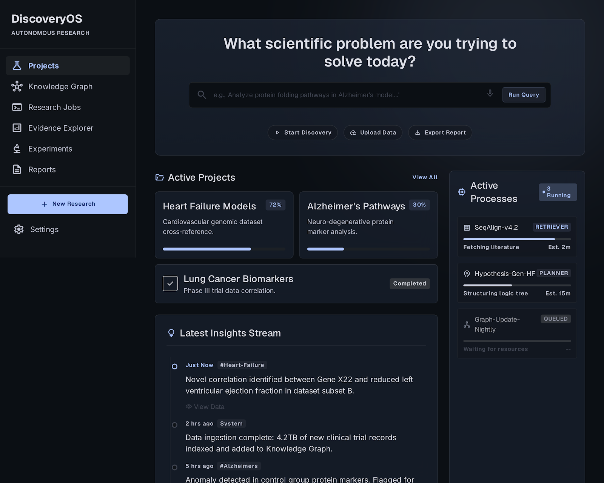
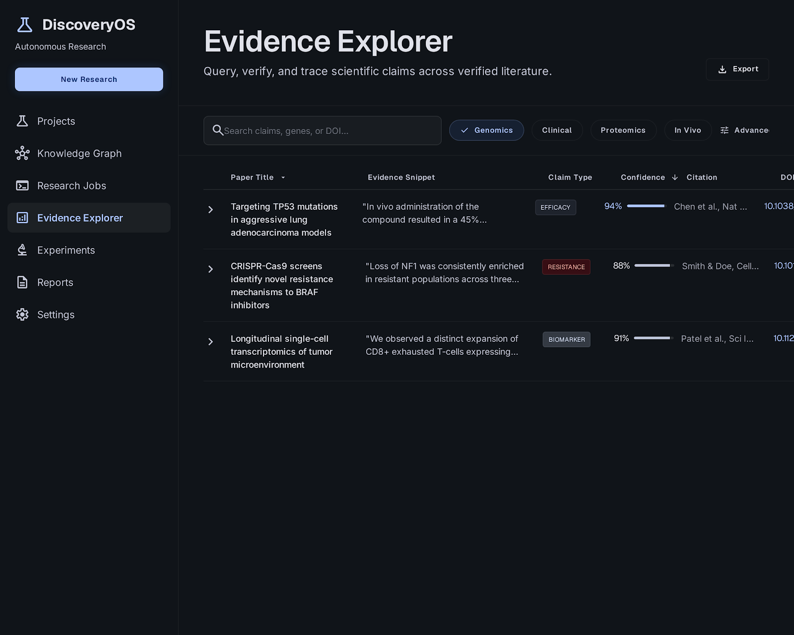
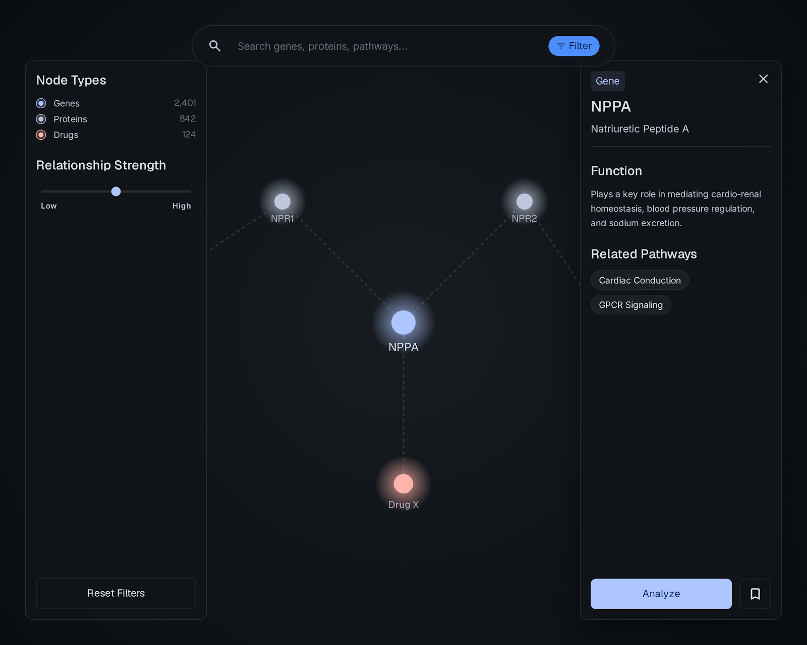
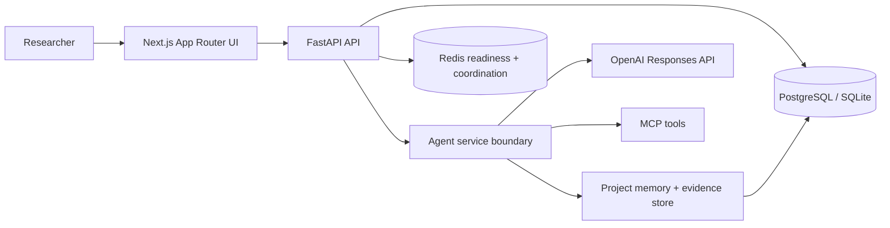
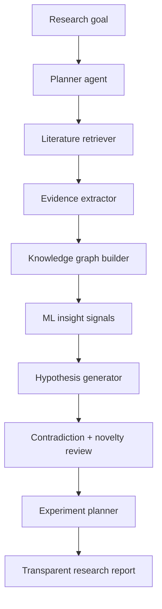

# DiscoveryOS



[](apps/web)
[](apps/api)
[](docs/11-HACKATHON_AI_USAGE.md)
[](docs/05-MCP.md)
[](docker-compose.yml)

DiscoveryOS is an autonomous scientific discovery workspace for turning research goals into evidence-backed hypotheses, knowledge graphs, experiment plans, and transparent reports.

It is built for the OpenAI Build Hackathon as a polished product demo, not a toy chatbot. The app shows how a research team can move from a question to an auditable discovery workflow with structured evidence, deterministic demo data, FastAPI services, OpenAI-ready agent boundaries, MCP integration points, and a production-shaped Next.js interface.

## Product

DiscoveryOS gives researchers a persistent workspace instead of a disposable chat thread:

- Plan a scientific workflow from a research goal.
- Retrieve and structure evidence into inspectable claims.
- Link entities, mechanisms, contradictions, and confidence in a knowledge graph.
- Surface ML-style novelty and contradiction signals.
- Generate experiment plans and reports with a visible evidence trail.
- Run a stable offline demo without live API dependencies.

## Screens

| Dashboard | Evidence Explorer | Knowledge Graph |
| --- | --- | --- |
|  |  |  |

## Architecture



## Research Pipeline



## Stack

- Frontend: Next.js 15, React 19, TypeScript, Tailwind CSS, React Query, React Flow.
- Backend: FastAPI, Pydantic, SQLAlchemy async, Alembic.
- Data: PostgreSQL in Docker, SQLite for local tests, Redis for readiness/coordination.
- AI: OpenAI Responses API boundary with structured-output-oriented agent design.
- Tools: MCP-ready integration layer for filesystem, memory, and external research tools.
- Operations: Docker Compose, health checks, seeded demo data, CI workflow.

## Quick Start

```bash
cp .env.example .env
docker compose up --build
```

Open:

- Web app: [http://localhost:3000](http://localhost:3000)
- API health: [http://localhost:8000/api/v1/health](http://localhost:8000/api/v1/health)
- API readiness: [http://localhost:8000/api/v1/ready](http://localhost:8000/api/v1/ready)

The default stack starts the frontend, API, PostgreSQL, and Redis. It runs migrations and seeds deterministic demo projects, including Heart Failure Biomarkers, Sustainable Battery Materials, Urban Heat Resilience, LLM Hallucination Detection, and Microplastics and Alzheimer's.

## Development

```bash
npm install
npm run dev:web
npm run dev:api
```

Quality checks:

```bash
npm run lint
npm run typecheck
python -m pytest apps/api/tests
```

Docker helpers:

```bash
make demo
make logs
make test
make down
```

Production-shaped Compose:

```bash
docker compose -f docker-compose.yml -f docker-compose.prod.yml up --build
```

## OpenAI

DiscoveryOS is designed around OpenAI's Responses API boundary for agent reasoning, structured outputs, synthesis, report generation, and future tool-calling workflows. The demo remains stable without an API key; live model calls can be enabled through `.env`.

```bash
DISCOVERYOS_OPENAI_API_KEY=
DISCOVERYOS_OPENAI_BASE_URL=https://api.openai.com/v1
DISCOVERYOS_OPENAI_MODEL=gpt-5.6
```

## MCP

The MCP layer is represented as a service boundary for research tools and project memory. The demo includes filesystem, memory, and GitHub-oriented server scaffolds in the legacy agent prototype and documents the intended tool contracts in [docs/05-MCP.md](docs/05-MCP.md).

## Repository

```text
apps/
  web/      Next.js product UI
  api/      FastAPI service used by Docker and tests
backend/   Legacy agent/orchestration prototype retained for reference
docs/      Architecture, MCP, AI, roadmap, and hackathon docs
scripts/   Demo seed and container startup scripts
storage/   Local runtime storage
logs/      Runtime logs
```

## Demo

Use the seeded dashboard flow:

1. Open the dashboard.
2. Click `Run Query`.
3. Watch the deterministic SSE pipeline advance through planning, retrieval, graph, and report stages.
4. Open Evidence Explorer, Knowledge Graph, Pipeline, Reports, and Settings from the project sidebar.

The full narration and Devpost-ready copy live in [docs/14-HACKATHON_DELIVERABLES.md](docs/14-HACKATHON_DELIVERABLES.md).

## License

License to be selected before public release.
