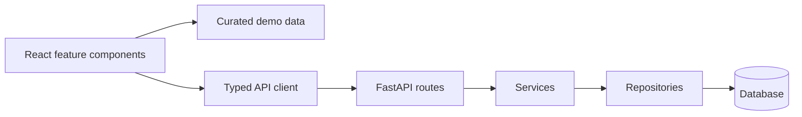
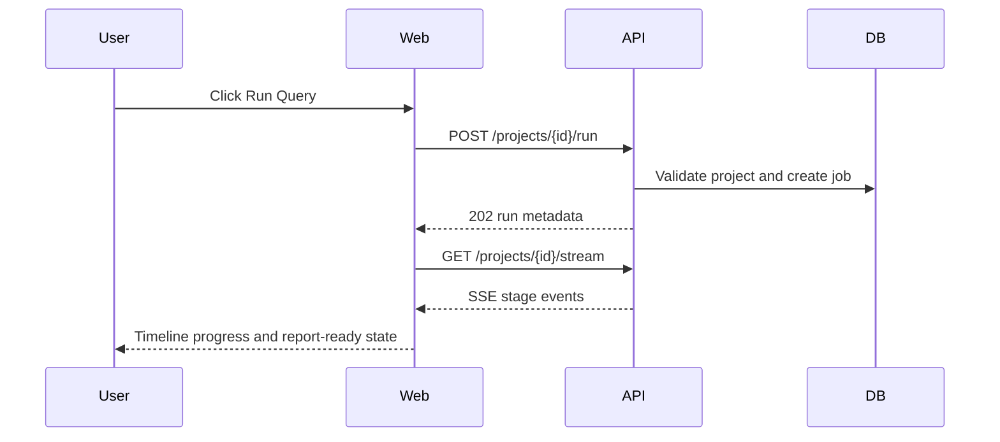

# DiscoveryOS Hackathon Deliverables

## 2-3 Minute Demo Script

**0:00-0:20 - Problem**

Scientific research is not a single prompt. It is a long-running workflow: planning, retrieval, evidence extraction, contradictions, hypotheses, experiments, and reporting. DiscoveryOS turns that workflow into a product.

**0:20-0:50 - Product**

Open the dashboard. The researcher starts with a concrete research goal. DiscoveryOS keeps this inside a persistent workspace with project memory, live pipeline state, and domain-specific research artifacts.

**0:50-1:25 - Pipeline**

Click `Run Query`. The FastAPI backend starts a deterministic demo run and streams progress over SSE: planner, retriever, graph, and report. The demo is offline-safe, so judging does not depend on live literature APIs.

**1:25-1:55 - Evidence and Graph**

Open Evidence Explorer and Knowledge Graph. Evidence remains inspectable instead of being flattened into prose. The graph connects claims, mechanisms, entities, contradictions, and confidence signals.

**1:55-2:25 - Reports and Experiments**

Open Reports and Experiments. DiscoveryOS turns the evidence trail into a transparent report and validation plans, making the next scientific step explicit.

**2:25-2:50 - Technical Close**

The stack is Next.js, FastAPI, PostgreSQL, Redis, OpenAI Responses API boundaries, and MCP-ready tool integration. `docker compose up --build` starts the full demo.

## Narration

DiscoveryOS is an autonomous scientific discovery workspace. The core idea is simple: research should not disappear into a chat transcript. It should become a reproducible system of plans, evidence, graph relationships, hypotheses, experiments, and reports.

In this demo I start from the dashboard and run a research goal. The backend streams the workflow stage by stage, so the UI reflects an actual product loop instead of a static mockup. Then I inspect the Evidence Explorer, where claims are separated from sources and confidence. I move into the Knowledge Graph to show how DiscoveryOS links mechanisms, findings, contradictions, and candidate hypotheses. Finally, the Reports and Experiments screens show how the system converts evidence into a decision-ready artifact.

Under the hood, DiscoveryOS uses a Next.js frontend, FastAPI backend, PostgreSQL, Redis, deterministic seed data, and OpenAI-ready agent boundaries. MCP is treated as the tool integration layer so the system can grow from local memory and filesystem tools into connected research infrastructure.

## Devpost Submission

**Title:** DiscoveryOS - Autonomous Scientific Discovery Workspace

**Tagline:** Turn research goals into evidence-backed hypotheses, knowledge graphs, experiment plans, and transparent reports.

**Inspiration:** Most AI research tools stop at answers. Scientific work needs process: evidence, contradictions, hypotheses, validation, and auditability. DiscoveryOS explores what a product built around that process can feel like.

**What it does:** DiscoveryOS provides a persistent research workspace. A user starts with a research goal, watches an agent-style pipeline execute, explores structured evidence, inspects a knowledge graph, reviews ML-style signals, and produces report-ready outputs.

**How we built it:** The product uses Next.js, React, Tailwind CSS, FastAPI, SQLAlchemy, PostgreSQL, Redis, Docker Compose, and an OpenAI Responses API integration boundary. The demo uses deterministic seed data and SSE streaming for reliable judging.

**OpenAI usage:** DiscoveryOS is designed for the Responses API as the reasoning and synthesis boundary for planning, extraction, contradiction analysis, novelty review, experiment design, and report generation. Structured outputs are emphasized so downstream services can validate and store model results.

**MCP usage:** MCP is the tool layer for memory, filesystem access, source retrieval, and future external integrations. DiscoveryOS keeps tool access behind service boundaries so agent workflows remain auditable.

**Challenges:** The biggest challenge was making a complex research workflow feel like a cohesive product rather than a pile of demos. We focused on routing performance, deterministic demo data, API contracts, and documentation polish.

**Accomplishments:** One-command Docker demo, production-shaped frontend, FastAPI service with health/readiness, seeded research projects, SSE pipeline, evidence explorer, graph explorer, and hackathon-ready docs.

**What is next:** Live literature connectors, deeper OpenAI structured-output execution, richer MCP tools, evaluator-driven prompt regression tests, authentication, team collaboration, and deployable cloud infrastructure.

## Technical Writeup

DiscoveryOS is organized as a monorepo with `apps/web` for the product UI and `apps/api` for the Docker-backed FastAPI service. The frontend uses static demo project data for instant navigation and a typed API client for pipeline operations. The backend exposes versioned health, readiness, project, memory, research job, and deterministic pipeline endpoints.

The primary demo path is stable by design. `scripts/seed_demo.py` creates frontend-aligned project IDs, and `/api/v1/projects/{project_id}/run` starts a research job only after validating that the project exists and that the query is non-empty. `/stream` returns server-sent events that the dashboard renders as live progress.

### Component Diagram

### Sequence Diagram

## Roadmap

- Replace deterministic demo events with real asynchronous orchestration.
- Add authentication, teams, and role-based project access.
- Add evaluator tests for prompts and structured outputs.
- Connect production MCP servers for literature, datasets, and lab systems.
- Add deployed observability, tracing, rate limiting, and budget controls.
- Generate report exports as PDF and DOCX artifacts.
